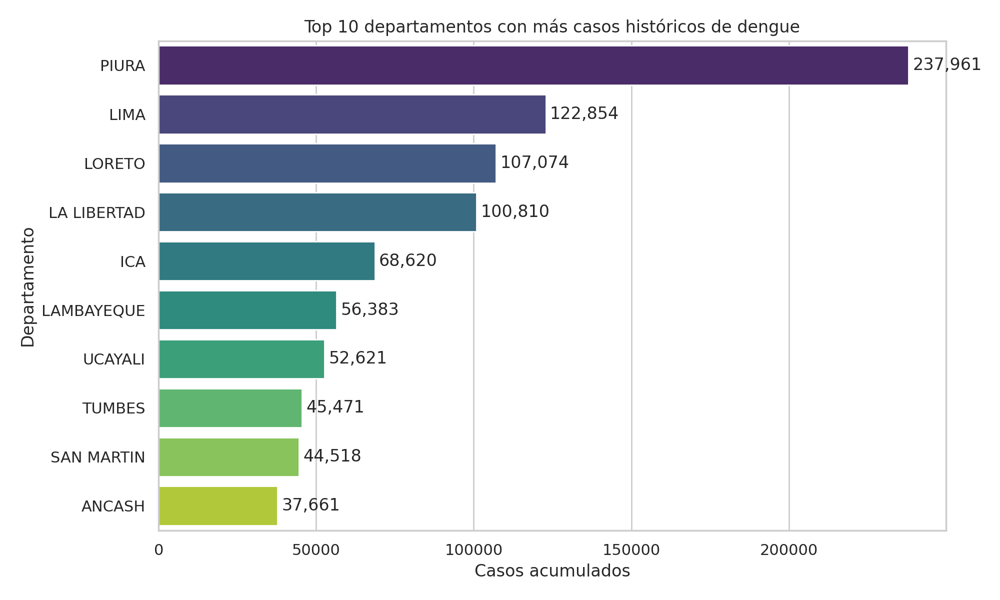
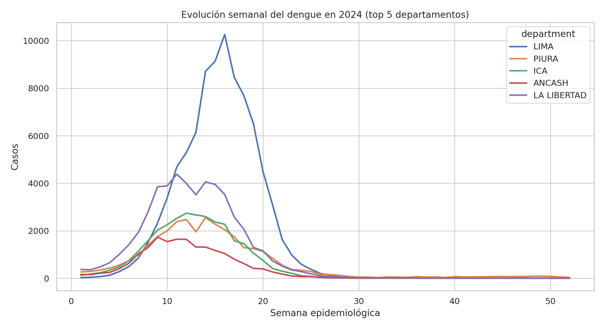
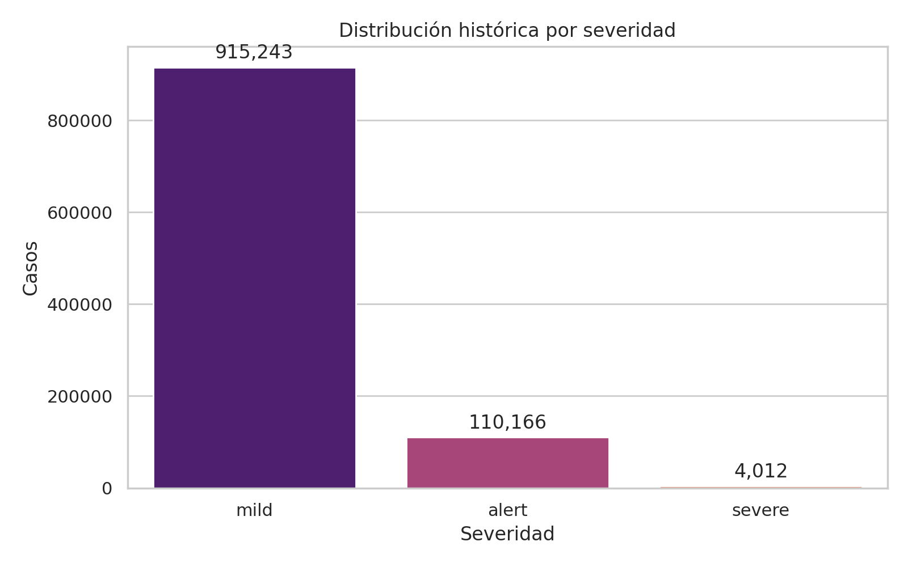

# Dengue Surveillance Analytics Peru

Proyecto de portafolio orientado a `Python + SQL Server + Docker Engine` usando datos reales y publicos del MINSA/CDC Peru sobre vigilancia epidemiologica de dengue entre 2000 y 2024.

La idea no es solo hacer un notebook: el proyecto construye un pipeline reproducible que:

- ingesta un CSV grande por lotes;
- limpia y normaliza variables reales de salud publica;
- carga los datos a SQL Server;
- crea vistas analiticas en SQL;
- genera graficos y un resumen ejecutivo automatico.

## Stack

- Python
- pandas
- SQLAlchemy
- SQL Server
- Docker Engine / Docker Compose
- matplotlib / seaborn
- pytest

## Dataset

Fuente oficial: [Vigilancia Epidemiologica de dengue - Datos Abiertos Peru](https://datosabiertos.gob.pe/dataset/vigilancia-epidemiologica-de-dengue)

Columnas observadas en el CSV:

- `departamento`
- `provincia`
- `distrito`
- `localidad`
- `enfermedad`
- `ano`
- `semana`
- `diagnostic`
- `diresa`
- `ubigeo`
- `localcod`
- `edad`
- `tipo_edad`
- `sexo`

Notas reales del dato:

- el archivo usa separador `;`;
- la primera columna trae BOM (`utf-8-sig`);
- `edad` depende de `tipo_edad` (`A`, `M`, `D`), por lo que el pipeline la convierte a anos;
- `localcod` tiene vacios en registros antiguos;
- el volumen supera el millon de filas, asi que la carga se hace por chunks.

## Arquitectura

```text
CSV oficial -> limpieza en Python -> tabla raw en SQL Server -> vistas SQL -> reporte y graficos
```

## Entorno objetivo

El proyecto esta preparado para ejecutarse en una VM Ubuntu con Docker Engine y Docker Compose.

- No requiere Docker Desktop.
- El flujo recomendado es clonar el repo dentro de la VM y ejecutar `docker compose` desde Ubuntu.
- Si decides correr Python fuera de Docker, necesitas tener SQL Server accesible y `ODBC Driver 18 for SQL Server` instalado en ese entorno.

## Estructura

```text
.
|-- main.py
|-- docker-compose.yml
|-- Dockerfile
|-- requirements.txt
|-- sql/
|   |-- 01_schema.sql
|   |-- 02_marts.sql
|   `-- 03_portfolio_queries.sql
|-- src/dengue_pipeline/
|   |-- config.py
|   |-- db.py
|   |-- pipeline.py
|   |-- processing.py
|   `-- reporting.py
`-- tests/
    `-- test_processing.py
```

## Como correrlo en Ubuntu VM

1. Instala Docker Engine y Docker Compose Plugin en la VM Ubuntu.

2. Clona este repositorio dentro de la VM y entra a la carpeta del proyecto.

3. Copia `.env.example` a `.env` si quieres personalizar credenciales.

4. Corre el pipeline completo con Docker Compose:

```bash
docker compose up --build
```

Esto levantara:

- un contenedor `sqlserver`;
- un contenedor `app` que ejecuta `python main.py run-all`.

## Ejecucion manual sin Docker

Si ya tienes SQL Server y ODBC Driver 18 instalados dentro de la VM, tambien puedes correr los pasos por separado:

```bash
python -m pip install -r requirements.txt
python main.py ingest
python main.py transform
python main.py report
```

En ese caso, ajusta `.env` segun corresponda. Por ejemplo:

- usa `SQLSERVER_HOST=localhost` si SQL Server corre en la misma VM fuera de Compose;
- usa `SQLSERVER_HOST=sqlserver` si corres la aplicacion dentro de Compose junto al contenedor de SQL Server.

## Salidas del proyecto

- tabla `raw_dengue_cases`
- vista `department_weekly_cases`
- vista `department_yearly_cases`
- vista `national_weekly_cases`
- consultas SQL de portafolio en `sql/03_portfolio_queries.sql`
- graficos en `reports/figures/`
- resumen ejecutivo en `reports/executive_summary.md`

## Preguntas que responde

- Que departamentos concentran mas casos historicos
- Como cambia la carga semanal del dengue por ano y territorio
- Que proporcion corresponde a cuadros graves o con signos de alarma
- Como se distribuyen los casos por sexo y edad aproximada

## Proximas mejoras

- dashboard con Streamlit
- modelo de forecasting semanal por departamento
- pruebas de calidad de datos
- integracion con dbt o Airflow

## Calidad de datos

- Registros totales cargados: 1,029,421 (100% del dataset fuente)
- Distribución por severidad: 88.9% sin signos de alarma, 10.7% con signos de alarma, 0.39% grave
- Cobertura temporal: 2000-2024, sin gaps detectados en semanas epidemiológicas
- Validación: la suma de las 3 categorías de severidad coincide exactamente con el total de filas ingeridas, confirmando 0% de pérdida de datos en la clasificación

## Resultados





